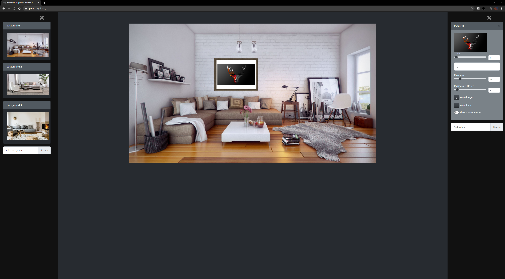

# Photo-Wall

This project was started to provide an easy to use and free mockup tool for photographers.  
You can use this tool to show photographs in different frames either at your own home or at a clients.  
This includes the possibility of showing the exact dimensions of the picture in the chosen space.
#### Demo: [jpmatz.de](https://www.jpmatz.de/demo)
#### Desktop-App: [jpmatz.de](https://www.jpmatz.de)

### Technical aspekt

To accomplish this goal a custom purely JS based render engine was created.
Since the entire application lives in the front-end a static webspace like a AWS-Bucket could be used for hosting, if one wanted to. 
